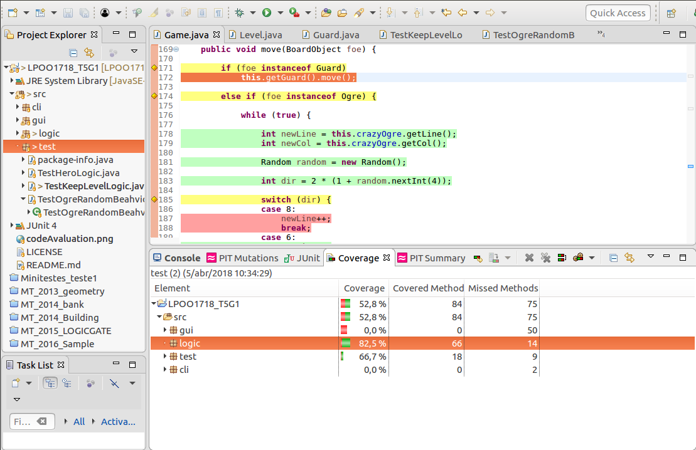
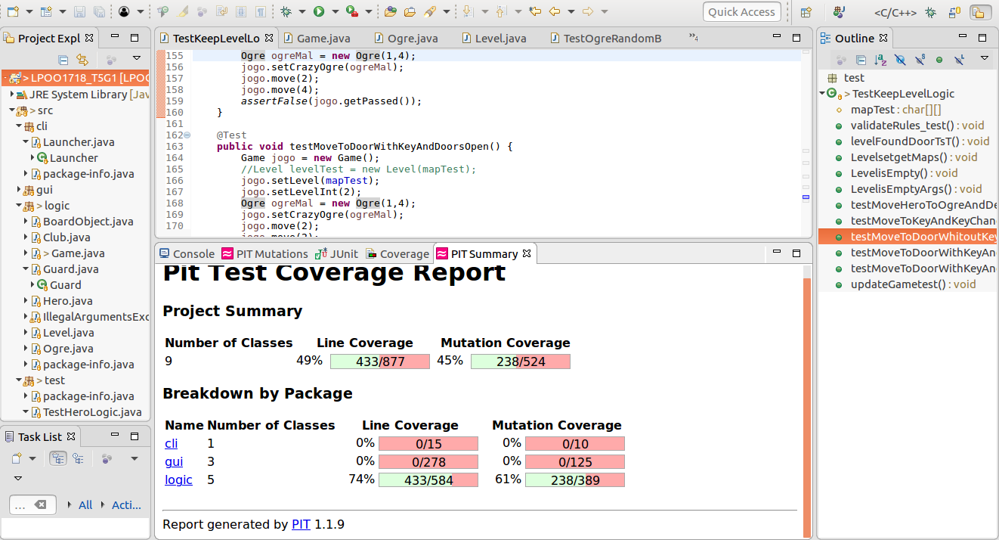
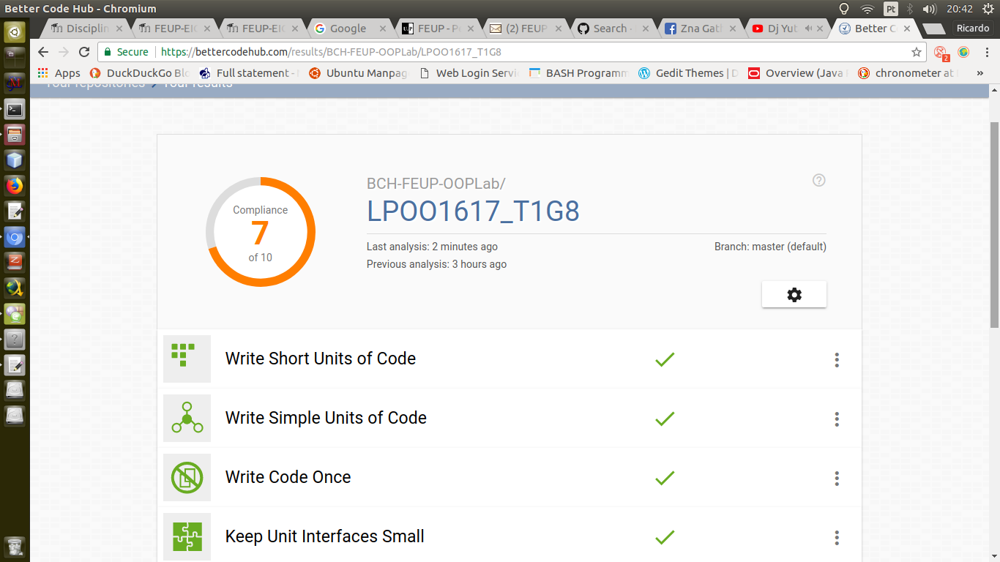

# LPOO1718_T5G1
Workcase LPOO
Guided Project 2017/2018

## Guidelines for the delivery:

### [A] 

__DONE__ Logic package API Documentation with Javadoc uploaded to github

### [B]  

__DONE__ 82,5 % of the game logic code Eclmma 

Print Screen file: converageJunit.png

__DONE__ PIT tool results: 61 %

Print Screen file: mutationCoverage.png

### [C]  

__DONE__ BetterCodeHub: Status badge 7 of 10

Print Screen file: codeAvaluation.png

### [D] 

__DONE__ Added the picture with the BetterCodeHub indicator
 

Follow Documentation link:

 
     https://tejinaco.github.io/LPOO1718_T5G1/

Group work by:

Ricardo Manuel Gonçalves da Silva - up201607780 - up201607780@fe.up.pt 

Luís Ricardo Marques Oliveira - up201607946 - up201607946@fe.up.pt

